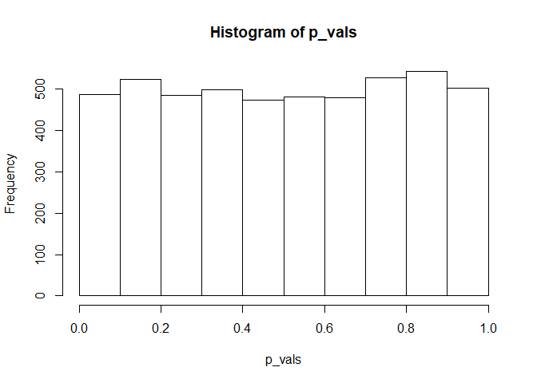
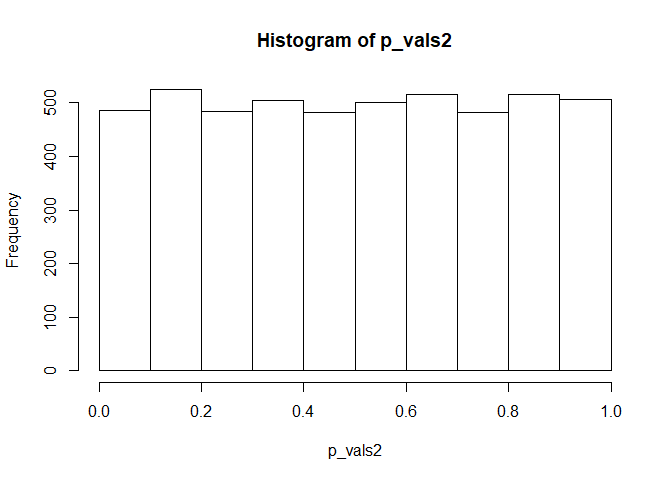
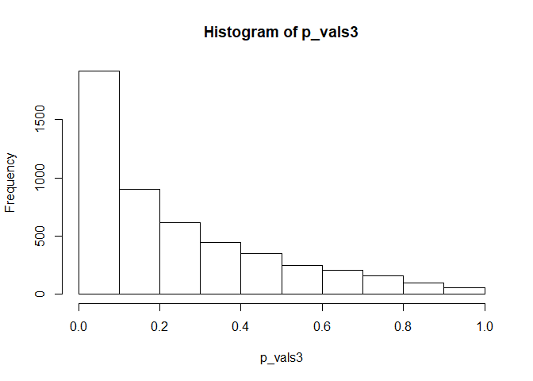
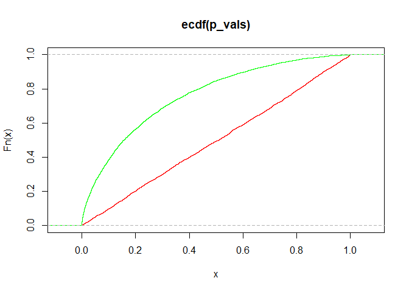
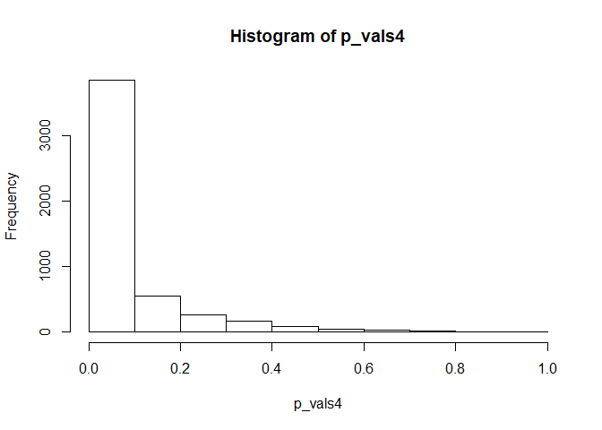
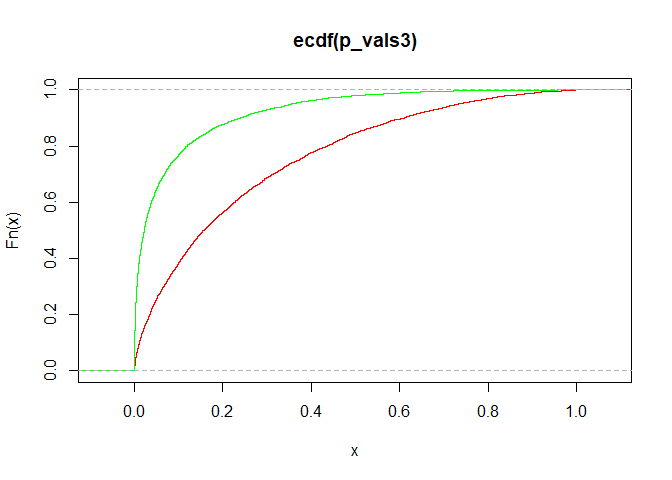
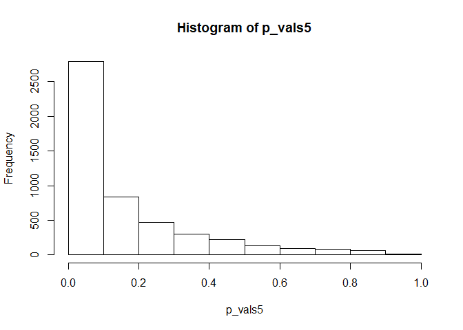
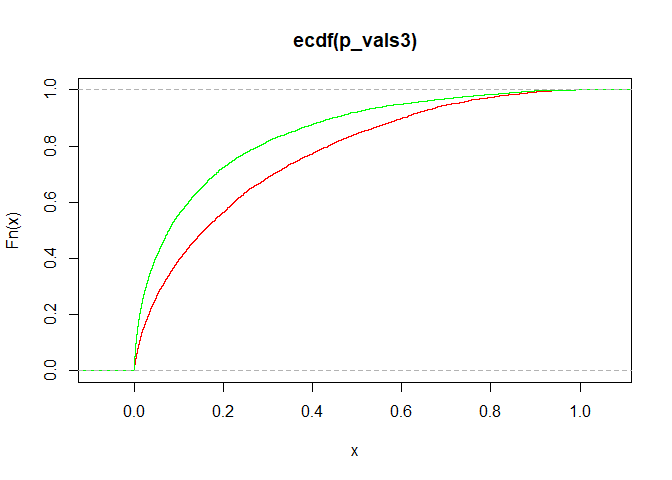

Multiple Comparisons: Homework - 1
================

# Submitted by:

Eyal Bar-Natan - 207630658

Omer Shubi - 312236219

# Question 1

## Part A

### 1\.

Given the question definitions:


and by using the Neyman-Pearson test:


``` r
mu <- 0
sd <- 2
n <- 16
iterations <- 5000

# Simulate 5000 tests, each with 16 samples, assuming H0 is correct meaning, mu~N(0,2^2)
means <- rnorm(iterations, mu, sd/sqrt(n))

# Calculate the z-score for each simulation
Z = (means-mu)/(sd/sqrt(n))

# Calculate the p-values
p_vals <- pnorm(Z, lower.tail = FALSE)

hist(p_vals, breaks=10)
```

<!-- -->

### 2\.

In our opinion, ![p\_{value}\\sim
Uni\[0, 1\]](https://latex.codecogs.com/png.latex?p_%7Bvalue%7D%5Csim%20Uni%5B0%2C%201%5D
"p_{value}\\sim Uni[0, 1]")

### 3\.

The proportion of p-values lower than 0.1 is:

``` r
length(p_vals[p_vals<0.1])/iterations
```

    ## [1] 0.0972

### 4\.

Probability for a Type 1 error, and it is equal to 0.1, by definition.

### 5\.

![PV = P\_{H\_0}(\\bar{X}\>\\bar{x}\_{obs}) =
P\_{H\_0}(2\\bar{X}\>2\\bar{X}\_{obs})= P(Z\>Z\_{obs})=1-P(Z\\leq
Z\_{obs}) = 1-F\_{Z}(Z\_{obs}) \\sim
Uni\[0,1\]](https://latex.codecogs.com/png.latex?PV%20%3D%20P_%7BH_0%7D%28%5Cbar%7BX%7D%3E%5Cbar%7Bx%7D_%7Bobs%7D%29%20%3D%20P_%7BH_0%7D%282%5Cbar%7BX%7D%3E2%5Cbar%7BX%7D_%7Bobs%7D%29%3D%20P%28Z%3EZ_%7Bobs%7D%29%3D1-P%28Z%5Cleq%20Z_%7Bobs%7D%29%20%3D%201-F_%7BZ%7D%28Z_%7Bobs%7D%29%20%5Csim%20Uni%5B0%2C1%5D
"PV = P_{H_0}(\\bar{X}\>\\bar{x}_{obs}) = P_{H_0}(2\\bar{X}\>2\\bar{X}_{obs})= P(Z\>Z_{obs})=1-P(Z\\leq Z_{obs}) = 1-F_{Z}(Z_{obs}) \\sim Uni[0,1]")

n and sd do not change the distribution function, as it is always
uniform\[0,1\], regardless of the values.

## Part B

``` r
mu <- 0
sd <- 2
n <- 32
iterations <- 5000

# Simulate 5000 tests, each with 16 samples, assuming H0 is correct meaning, mu~N(0,2^2)
means <- rnorm(iterations, mu, sd/sqrt(n))

# Calculate the z-score for each simulation
Z = (means-mu)/(sd/sqrt(n))

# Calculate the p-values
p_vals2 <- pnorm(Z, lower.tail = FALSE)

hist(p_vals2, breaks=10)
```

<!-- -->

In our opinion, ![p\_{value}\\sim
Uni\[0, 1\]](https://latex.codecogs.com/png.latex?p_%7Bvalue%7D%5Csim%20Uni%5B0%2C%201%5D
"p_{value}\\sim Uni[0, 1]").

According to what we proved in the previous section, when
 is correct, the
distribution function of P-Value is independent of the parameters:
,. Therefore the
distrubtion function stays the same.

## Part C

### 1\.

``` r
mu <- 0.5
sd <- 2
n <- 16
iterations <- 5000

# Simulate 5000 tests, each with 16 samples, assuming H0 is correct meaning, mu~N(0,2^2)
means <- rnorm(iterations, mu, sd/sqrt(n))

# Calculate the z-score for each simulation
Z = (means-0)/(sd/sqrt(n))

# Calculate the p-values
p_vals3 <- pnorm(Z, lower.tail = FALSE)

hist(p_vals3, breaks=10)
```

<!-- --> \#\#\#
2.

``` r
plot(ecdf(p_vals),col='red')
lines(ecdf(p_vals3),col='green')
```

<!-- -->

P-value is stochastic smaller when the alternative is true.

This is intuitive because as p-value is smaller, it is easier to
disprove , and as
the alternative is true
 we get
small p-value.

### 3\.

The proportion of p-values lower than 0.1 is:

``` r
length(p_vals3[p_vals3<0.1])/iterations
```

    ## [1] 0.383

``` r
1-pnorm(0.282)
```

    ## [1] 0.3889718

## Part D

### 1\.

``` r
mu <- 1
sd <- 2
n <- 16
iterations <- 5000

# Simulate 5000 tests, each with 16 samples, assuming H0 is correct meaning, mu~N(0,2^2)
means <- rnorm(iterations, mu, sd/sqrt(n))

# Calculate the z-score for each simulation
Z = (means-0)/(sd/sqrt(n))

# Calculate the p-values
p_vals4 <- pnorm(Z, lower.tail = FALSE)

hist(p_vals4, breaks=10)
```

<!-- -->

### 2\.

``` r
plot(ecdf(p_vals3),col='red')
lines(ecdf(p_vals4),col='green')
```

<!-- -->

Assuming 
results in stochastically lower p-values compared to when
.

Lower p-values give stronger evidence that we should reject the null
hypothesis.

And this makes sense as a higher mu is a indicates that the null
hypothesis is not the reality.

### 3\.

The proportion of p-values lower than 0.1 is:

``` r
length(p_vals4[p_vals4<0.1])/iterations
```

    ## [1] 0.767

The proportion increased as the power of the test increased. The power
increased because the mu is farther from ,
and because the power is an increasing monotone as a function of mu (by
definition).

Assuming
 and the Neyman-Pearson test:

``` r
1-pnorm(1.282-2)
```

    ## [1] 0.7636214

## Part E

### 1\.

``` r
mu <- 0.5
sd <- 2
n <- 32
iterations <- 5000

# Simulate 5000 tests, each with 16 samples, assuming H0 is correct meaning, mu~N(0,2^2)
means <- rnorm(iterations, mu, sd/sqrt(n))

# Calculate the z-score for each simulation
Z = (means-0)/(sd/sqrt(n))

# Calculate the p-values
p_vals5 <- pnorm(Z, lower.tail = FALSE)

hist(p_vals5, breaks=10)
```

<!-- -->

``` r
plot(ecdf(p_vals3),col='red')
lines(ecdf(p_vals5),col='green')
```

<!-- -->

``` r
length(p_vals5[p_vals5<0.1])/iterations
```

    ## [1] 0.5528

We can see from the formula that it is decreasing monotone as a function
of n. Therefore a higher n results in lower p-values. This is exactly
what we see in the observations, but of course can be predicted strictly
from the formula.

## F.

Summary:

Assuming the null hypothesis is correct:

  - ![P-Value \\sim
    Uni\[0,1\]](https://latex.codecogs.com/png.latex?P-Value%20%5Csim%20Uni%5B0%2C1%5D
    "P-Value \\sim Uni[0,1]")

  - It is not affected by changes in
     or by
    .

Assuming the alternative hypothesis is correct:

  - P-value is stochastic smaller when the alternative is true compared
    to when the null is true.

  - *Lower values* get *higher probability*, and *higher values* get
    *lower probability*, as mu (and/or) n increase.

  - *Increasing* the standard diviation has the same effect as
    *decreasing* mu (and/or) n. High enough sd give a result that
    resembles the Uni\[0,1\] distribution.
