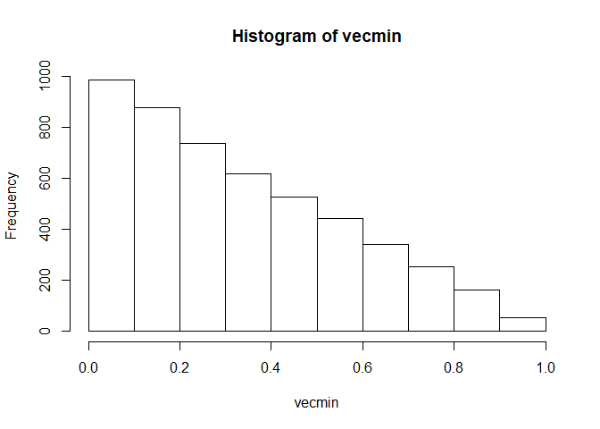
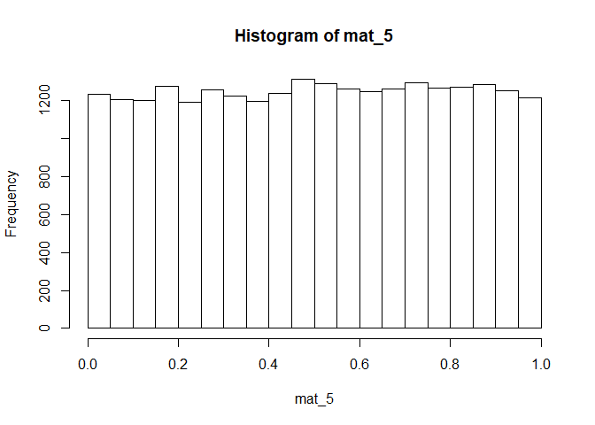
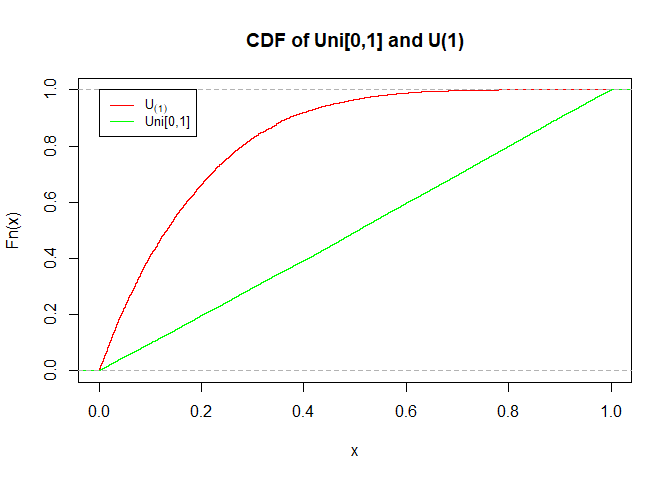
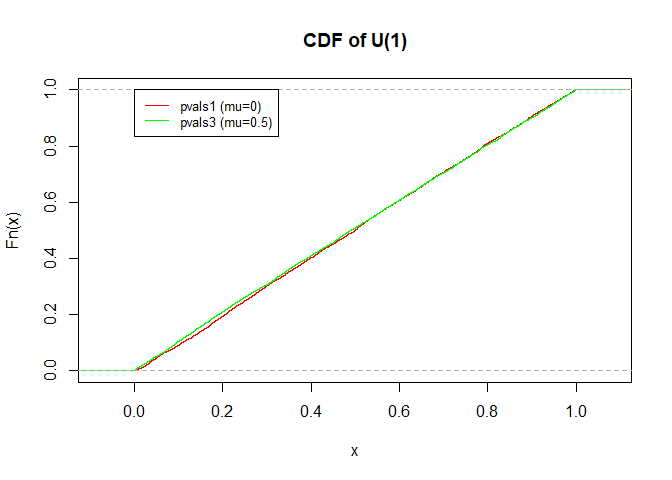
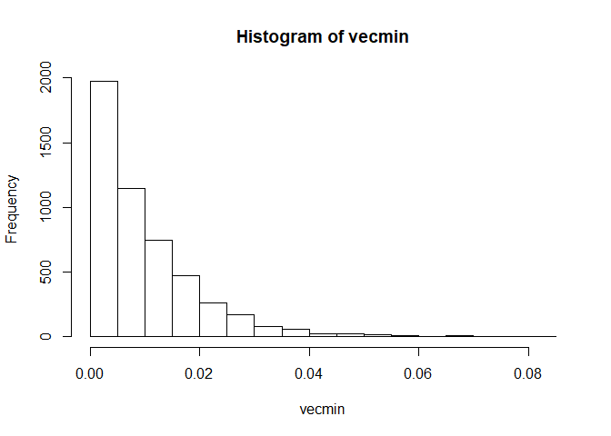
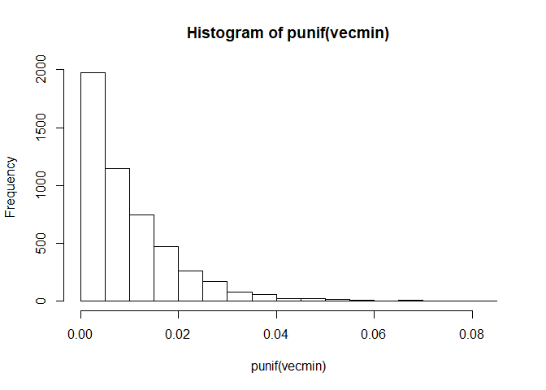
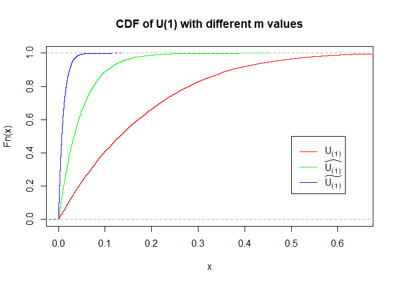
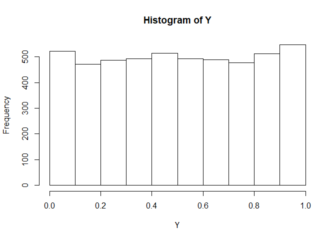

Multiple Comparisons: Homework - 2
================


# Question 1

## Part A

We perform
 simulations, in which each time we randomly pick
 values out a
Uniform Distribution (![U\\sim
Uni\[0,1\]](https://latex.codecogs.com/png.latex?U%5Csim%20Uni%5B0%2C1%5D
"U\\sim Uni[0,1]")). In each simulation, out of the picked values we
select the one with the minimum value. The result of these simulations
is stored in
.

``` r
iterations <- 5000
```

``` r
m <- 5
mat_5 <- replicate(iterations, runif(m,0, 1))
vecmin_5 <- apply(mat_5, 2, min)
```

and similarly with :

``` r
m <- 20
mat_20 <- replicate(iterations, runif(m,0, 1))
vecmin_20 <- apply(mat_20, 2, min)
```

and :

``` r
m <- 100
mat_100 <- replicate(iterations, runif(m,0, 1))
vecmin_100 <- apply(mat_100, 2, min)
```

### 1\.

The proportion of
}\<0.05") when :

``` r
length(vecmin_5[vecmin_5<0.05])/iterations
```

    ## [1] 0.2256

Similarly to section
 in
H.W. 1 - in which ![p\_{value}\\sim
Uni\[0,1\]](https://latex.codecogs.com/png.latex?p_%7Bvalue%7D%5Csim%20Uni%5B0%2C1%5D
"p_{value}\\sim Uni[0,1]"), and we were requested to retrieve the
minimal .

This is exactly what we are asked to find in this question as well, by
defining ![U\_i={p\_{value}}\_i\\sim
Uni\[0,1\]](https://latex.codecogs.com/png.latex?U_i%3D%7Bp_%7Bvalue%7D%7D_i%5Csim%20Uni%5B0%2C1%5D
"U_i={p_{value}}_i\\sim Uni[0,1]") and } = min(U_1,U_2,\\ldots,U_m)") we are dealing with the same
thing.

### 2\.

Histogram of
}") with :

``` r
hist(vecmin_5, xlim=c(0,1))
```

<!-- --> Histogram of
 with
:

``` r
hist(mat_5, xlim=c(0,1))
```

<!-- -->

By running the ecdf function we can visual the cdf of both functions
clearly.

``` r
plot(ecdf(vecmin_5),col='red', main='CDF of Uni[0,1] and U(1)', xlim=c(0,1))
lines(ecdf(mat_5),col='green')
legend(0, 1, legend=c(expression(U[(1)]), 'Uni[0,1]'), col=c("red", "green"), lty=1, cex=0.8)
```

<!-- --> As can be seen
from both the histograms and the cdf functions,

it is clear that
}") is stochastically smaller
() than
![Uni\[0,1\]](https://latex.codecogs.com/png.latex?Uni%5B0%2C1%5D
"Uni[0,1]").

### 3\.

Histogram of
}") with :

``` r
hist(vecmin_5, xlim=c(0,1))
```

<!-- --> Histogram of
}") with :

``` r
hist(vecmin_20, breaks = 20, xlim=c(0,1))
```

<!-- --> Histogram of
}") with :

``` r
hist(vecmin_100, xlim=c(0,1))
```

<!-- -->

``` r
plot(ecdf(vecmin_5),col='red', main='CDF of U(1) with different m values', xlim=c(0,0.65))
lines(ecdf(vecmin_20),col='green')
lines(ecdf(vecmin_100),col='blue')

legend(0.5, 0.5, legend=c(expression(U[(1)],widehat(U[(1)]),widetilde(U[(1)]))), col=c("red", "green", "blue"), lty=1)
```

<!-- -->
}") is with , }") is with
 and
}") is with
.

It can be clearly observed that:

if  then } \\prec U_{(1)}'")

if  then } \\succ U_{(1)}'")

## Part B.

}}(x) = P(U_{(1)}\<x) = 1 - P(U_{(1)}\\geq x) = 1 -P(U_{1}\\geq x,\\ldots , U_{m}\\geq x)")

*\\ldots* P(U_{m}\\geq x) = 1 - (1-x)^m"),
. 

This comes from independence of
, definition of
}") and uniform distribution.

Proof of part 2:

}\\prec U_i \\iff P(U_{(1)}\\leq a) \\geq P(U_i\\leq a)")

}}(a) \\geq F_{U_{i}}(a)")

)^{m}\\geq F_{U_{i}}(a)")

\\geq (1-F_{U_{i}}(a))^{m}")

)^{m-1}")

")

\\geq 0")


Proof of part 3:

}\\prec U_{(1)} \\iff F_{U'_{(1)}}(a)\\geq F_{U_{(1)}}(a)")

)^{m'} \\geq 1-(1-F_{U_{i}}(a))^{m}")

)^{m'}\\leq (1-F_{U_{i}}(a))^{m}")

)^{m'}\\leq (1-F_{U_{i}}(a))^{m}")

)^{m'-m}"), 

\\leq 1")

, which is always true.


## Part C.

}}(x) = 1 - (1-F_{U_{i}}(x))^{m} = 1 - (1-x)^{m}")

Therefore,

}\\leq g(t,m)) = F_{U_{(1)}}(g(t,m)) = 1-(1-g(t,m))^{m} = t")

)^{m}")

^{1/m} = 1 - g(t,m)")

= 1 - (1-t)^{1/m}")

Therefore, the function is : = 1 - (1-t)^{1/m}").

## Part D.

}\\leq 1 - (1-t)^{1/m}) = t")

}\\geq (1-t)^{1/m}) = t")

})^{m}\\geq 1 -t) = t")

})^{m}\\leq t) = t")

Therefore the random variable
 is given by: }) = 1-(1-U_{(1)})^{m}")

## Part E.

``` r
Y <- 1-(1-vecmin_100)^100
hist(Y)
```

<!-- --> For
})^m"),

as can be seen, the random variable
 that we found , holds
![Y\\sim
Uni\[0,1\]](https://latex.codecogs.com/png.latex?Y%5Csim%20Uni%5B0%2C1%5D
"Y\\sim Uni[0,1]") as expected.

## Part F.

### 1\.

This corresponds exactly to the function we found in part C:

^{\\frac{1}{m}}")

where  is the total
number of courses (because

according to the question assumptions).

So for
 we get:

^{\\frac{1}{m}} = 1-(0.95)^{\\frac{1}{m}}")

As we showed and proved in previous sections, this equation provides the
adjusted pvalue, as desired.

For  we get
. Therefore the desired
bound should be \~.

# Question 2

## Part 1 - Sidak’s Adjusted p-values

^{\\frac{1}{m}}=\\alpha_{sid}") ^{\\frac{1}{m}}\\leq 1") ^{\\frac{1}{m}}\\leq 1-P_i")
^m")
^m")

Therefore,

^m")

## Part 2 - Simultaneous CI are FWER controlling Proc.

 \\underbrace{=}_{(1)} P(\\exists\\space i: \\mu_i \\in M_0,\\space\\mu_{i}\\notin I_{i}'(X)) \\underbrace{\\leq}_{(2)} P(\\exists\\space i: \\mu_i \\in M, \\space\\mu_{i}\\notin I_{i}'(X))\\underbrace{\\leq}_{(3)}\\alpha")

1)  By definition of the test, as we know that rejecting
     by the
    dual-sided test is equivalent to rejecting
     by the eq.
    CI.
2)   therefore it holds that \\leq Pr(x\\in M)").
3)  By definition of simultaneous confidence intervals.

Therefore, the given test is a FWER-controlling procedure at level
.

## Part 3 - Bonferroni CI are Simultaneous CI

As seen in class, bonferroni CI for
 at
confidence level
 if it holds that ) = 1-\\frac{\\alpha}{m}") or alternatively
")
) = \\frac{\\alpha}{m}")

Therefore,

) = P(\\bigcup\\limits_{i=1}^m \\{\\mu_i \\notin I_i'(X)\\})")
) \\underbrace{=}_{\\mbox{from }(*)} \\sum\\limits_{i=1}^{m}\\frac{\\alpha}{m} = \\alpha")

And therefore Bonferroni CI are also Simultaneous CI.

No assumptions are needed for bonferroni.

## Part 4 - Sidak CI

We construct Simultaneous CI that are equivalent to Sidak’s procedure by
constructing Sidak CI that hold:

) = \\alpha_{sid} = 1-(1-\\alpha)^\\frac{1}{m} \\iff")

![P(\\mu\_i \\in I\_i'(X)) = 1- \\alpha\_{sid} = 1-
\[1-(1-\\alpha)^\\frac{1}{m}\] =
(1-\\alpha)^\\frac{1}{m}](https://latex.codecogs.com/png.latex?P%28%5Cmu_i%20%5Cin%20I_i%27%28X%29%29%20%3D%201-%20%5Calpha_%7Bsid%7D%20%3D%201-%20%5B1-%281-%5Calpha%29%5E%5Cfrac%7B1%7D%7Bm%7D%5D%20%3D%20%281-%5Calpha%29%5E%5Cfrac%7B1%7D%7Bm%7D
"P(\\mu_i \\in I_i'(X)) = 1- \\alpha_{sid} = 1- [1-(1-\\alpha)^\\frac{1}{m}] = (1-\\alpha)^\\frac{1}{m}")
")

) \\underbrace{=}_{\\mbox{independent}} \\prod\\limits_{i=1}^m P(\\mu_i \\in I_i'(X))")

![\\underbrace{=}\_{(\*)}\\prod\\limits\_{i=1}^m\[(1-\\alpha)^\\frac{1}{m}\]
= 1-\\alpha](https://latex.codecogs.com/png.latex?%5Cunderbrace%7B%3D%7D_%7B%28%2A%29%7D%5Cprod%5Climits_%7Bi%3D1%7D%5Em%5B%281-%5Calpha%29%5E%5Cfrac%7B1%7D%7Bm%7D%5D%20%3D%201-%5Calpha
"\\underbrace{=}_{(*)}\\prod\\limits_{i=1}^m[(1-\\alpha)^\\frac{1}{m}] = 1-\\alpha")

) = \\alpha")

Therefore Sidak’s CI are also Simultaeous CI and are equivalent to the
procedure.

The assumptions needed are that the test statistics are independent from
each other.
