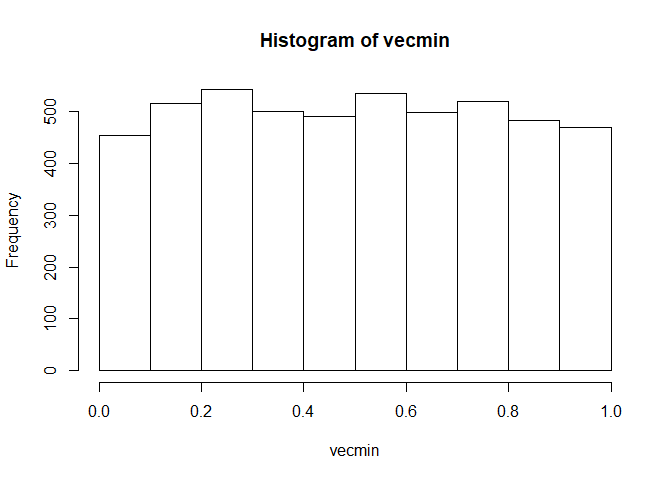

Multiple Comparisons: Homework - 2
================

# Submitted by:

Eyal Bar-Natan - 207630658

Omer Shubi - 312236219

# Question 1

## Part A

### 1\.

``` r
iterations <- 5000
m <- 5
mat <- replicate(iterations, runif(m,0, 1))
vecmin <- apply(mat, 2, min)
hist(vecmin)
```

<!-- -->

``` r
length(vecmin[vecmin<0.05])/iterations
```

    ## [1] 0.2272

Exactly like taking the minimum p\_value, becuase
p-value
Uni\[0,1\] in 

### 2\.

By running the ecdf function we can visual the cdf of both functions
clearly.

``` r
plot(ecdf(vecmin),col='red', main='CDF of U(1)')
lines(ecdf(mat[1,]),col='green')
legend(0, 1, legend=c('pvals1 (mu=0)', 'pvals3 (mu=0.5)'), col=c("red", "green"), lty=1, cex=0.8)
```

<!-- -->

``` r
# TODO update legend
# TODO update vecmin names
```

It is clear that
}") is stochastically smaller
() than
![Uni\[0,1\]](https://latex.codecogs.com/png.latex?Uni%5B0%2C1%5D
"Uni[0,1]")

### 3\.

``` r
iterations <- 5000
m <- 20
mat <- replicate(iterations, runif(m,0, 1))
vecmin <- apply(mat, 2, min)
hist(vecmin)
```

<!-- -->

``` r
iterations <- 5000
m <- 100
mat <- replicate(iterations, runif(m,0, 1))
vecmin <- apply(mat, 2, min)
hist(vecmin)
```

<!-- -->

``` r
iterations <- 5000
m <- 2
mat <- replicate(iterations, runif(m,0, 1))
vecmin <- apply(mat, 2, min)
hist(vecmin)
```

<!-- -->

``` r
iterations <- 5000
m <- 1
vecmin <- replicate(iterations, runif(m,0, 1))
hist(vecmin)
```

<!-- -->

if  then } \\prec U_{(1)}'")

if  then } \\succ U_{(1)}'")

## Part B.

``` r
# TODO add proof from Eyal of 2 & 3
```

$U\_{(1)}U\_i P(U\_{(1)}a) P(U\_ia) $

``` r
plot(ecdf(vecmin),col='red', main='CDF of U(1)')
lines(ecdf(mat[1,]),col='green')
legend(0, 1, legend=c('pvals1 (mu=0)', 'pvals3 (mu=0.5)'), col=c("red", "green"), lty=1, cex=0.8)
```

<!-- -->

``` r
# TODO update legend
# TODO update vecmin names
```

} \\sim Beta(1,m)") therefore has the same cdf of Beta(1,m).

## Part C.

``` r
iterations <- 5000
m <- 100
mat <- replicate(iterations, runif(m,0, 1))
vecmin <- apply(mat, 2, min)
hist(vecmin)
```

<!-- -->

``` r
hist(punif(vecmin))
```

<!-- -->
